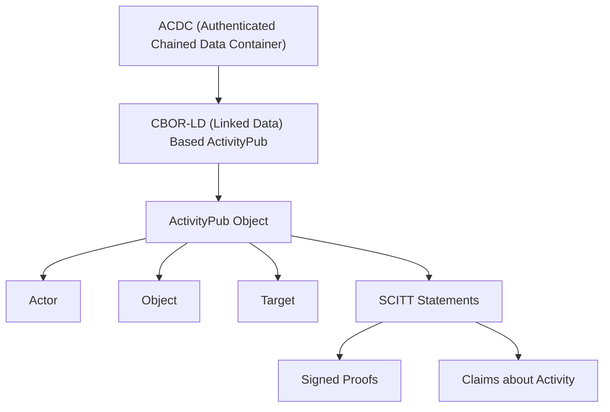

### ACDC with CBOR-LD Based Version of ActivityPub and SCITT Statements

> This spec doc, along with the **Mermaid diagram** and **CDDL schema**, provides a comprehensive description of how ACDC encapsulates a CBOR-LD ActivityPub object with embedded SCITT statements, ensuring cryptographic integrity and verifiability.

Below is a detailed specification of how **ACDC (Authenticated Chained Data Containers)** could encapsulate a **CBOR-LD** version of **ActivityPub** data with embedded **SCITT (Supply Chain Integrity, Transparency, and Trust)** statements.

#### Mermaid Diagram



### Structure Overview

1. **ACDC (Authenticated Chained Data Container)**: This container holds a signed and verified data structure that ensures the authenticity and integrity of the data, chaining together multiple attestations or claims.

2. **CBOR-LD (Compact Binary Representation for Linked Data)**: The container is serialized using **CBOR-LD**, a compact binary representation of linked data that reduces the payload size while retaining semantic richness, aligned with JSON-LD.

3. **ActivityPub Object**: The **CBOR-LD** structure contains an **ActivityPub** object, which includes key elements like `Actor`, `Object`, `Target`, etc., following the ActivityPub protocol.

4. **SCITT Statements**: Inside the ActivityPub object, SCITT statements are included. These statements provide signed proofs and integrity claims about the content or actions within the ActivityPub object, ensuring that the activity and its metadata can be verified in a transparent and trustworthy way.

### CDDL Markdown Block

Below is a **Concise Data Definition Language (CDDL)** representation of the **CBOR-LD version of ActivityPub** encapsulating the **SCITT statements**.

```cddl
activitypub-container = {
    "id": tstr,
    "type": "Activity",
    "actor": actor,
    "object": object,
    "target": target,
    "published": time,
    "scittStatements": [scitt-statement]
}

actor = {
    "id": tstr,
    "type": "Person" / "Organization",
    "name": tstr,
    "url": tstr
}

object = {
    "id": tstr,
    "type": "Note" / "Article" / "Image" / "Video",
    "content": tstr,
    "mediaType": tstr
}

target = {
    "id": tstr,
    "type": "Person" / "Organization",
    "name": tstr,
    "url": tstr
}

scitt-statement = {
    "claim": claim,
    "proof": proof
}

claim = {
    "claimType": tstr,
    "description": tstr,
    "contentHash": bstr,
    "signer": tstr
}

proof = {
    "signature": bstr,
    "signingAlgorithm": tstr,
    "timestamp": time
}

time = number ; Unix timestamp (seconds since epoch)
```

### Explanation of CDDL Schema

1. **activitypub-container**: Represents the overall structure of an **ActivityPub** object inside a CBOR-LD envelope. It includes:
   - `id`: A string identifier for the activity.
   - `type`: Specifies the type of the activity (e.g., `"Activity"`).
   - `actor`: Defines the **Actor** (could be a person or organization) that initiates the activity.
   - `object`: The primary object of the activity (e.g., a post, image, or article).
   - `target`: Specifies the target of the activity, which could be another person or group.
   - `published`: The time the activity was published.
   - `scittStatements`: An array of **SCITT** statements to ensure the integrity and trust of the activity.

2. **actor**: Describes the actor (either a person or an organization) that performs the activity.
   - `id`: The unique identifier of the actor.
   - `type`: The type of actor (e.g., `"Person"` or `"Organization"`).
   - `name`: The display name of the actor.
   - `url`: The URL associated with the actor.

3. **object**: Represents the object of the activity, such as a post, image, or article.
   - `id`: The unique identifier of the object.
   - `type`: The type of object (e.g., `"Note"`, `"Article"`, `"Image"`, `"Video"`).
   - `content`: The textual content of the object (e.g., the post's body or description).
   - `mediaType`: Specifies the media type of the object (e.g., `"text/plain"` for a post or `"image/jpeg"` for an image).

4. **target**: Describes the target entity that the activity is addressed to.
   - `id`: The unique identifier of the target.
   - `type`: The type of target (e.g., `"Person"` or `"Organization"`).
   - `name`: The display name of the target.
   - `url`: The URL associated with the target.

5. **scitt-statement**: A container for SCITT statements that ensure the integrity of the activity and its object.
   - `claim`: Contains the claims about the activity or object, including a hash of the content, a description, and the signer's identity.
   - `proof`: The cryptographic proof (signature) and metadata to verify the claim.

6. **claim**: Represents the specific claim being made about the object or activity.
   - `claimType`: The type of claim being made (e.g., `"Integrity"`, `"Authenticity"`).
   - `description`: A human-readable description of the claim.
   - `contentHash`: A binary string containing the hash of the content being claimed.
   - `signer`: The identity of the entity that signed the claim.

7. **proof**: Contains cryptographic data that proves the validity of the claim.
   - `signature`: A binary string representing the cryptographic signature.
   - `signingAlgorithm`: The algorithm used to generate the signature (e.g., `"Ed25519"`).
   - `timestamp`: The Unix timestamp of when the signature was generated.

### Spec Document

---

#### **Spec: ActivityPub CBOR-LD with Embedded SCITT Statements in ACDC**

##### **1. Overview**
This document describes how an **ActivityPub** object can be encapsulated in an **ACDC (Authenticated Chained Data Container)**, serialized as **CBOR-LD**. It also details how **SCITT (Supply Chain Integrity, Transparency, and Trust)** statements are included within the object to ensure the activity’s integrity, transparency, and cryptographic verification.

##### **2. ACDC Container**
The **ACDC** acts as a cryptographic wrapper around the **ActivityPub** object, providing authentication and integrity guarantees for the data it holds. It includes **SCITT statements** as proofs of the integrity and authenticity of the activity and its associated objects.

##### **3. CBOR-LD Representation**
The **CBOR-LD** format is used to serialize the **ActivityPub** object and any associated metadata. **CBOR-LD** is a binary, compact form of linked data, designed to reduce overhead while maintaining the semantics of the structured data.

##### **4. ActivityPub Structure**
The core of the **CBOR-LD** object is a traditional **ActivityPub** object, which includes fields such as:
   - **Actor**: The initiator of the activity.
   - **Object**: The content or object related to the activity (e.g., a post or image).
   - **Target**: The entity that is the recipient of the activity.

##### **5. SCITT Statements**
SCITT statements are included in the **ActivityPub** object to ensure:
   - **Integrity**: The activity content has not been altered since the time of publishing.
   - **Transparency**: There is an auditable trail of the claims and proofs attached to the activity.
   - **Trust**: The activity and its claims are signed by a trusted entity.

##### **6. Cryptographic Proof**
Each **SCITT statement** includes a cryptographic signature and metadata about the signing algorithm and timestamp. These elements allow the recipient to verify the integrity of the activity and its object in a transparent and trustworthy way.
